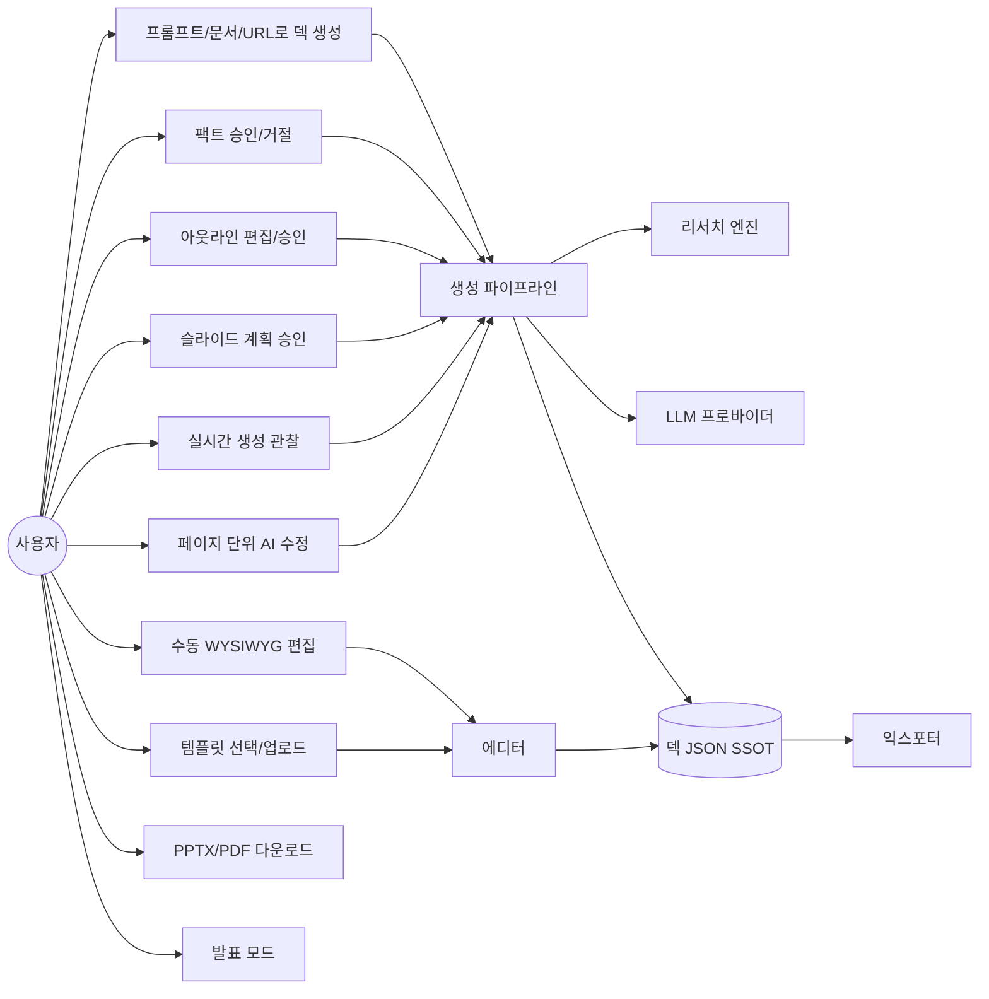

# USER SCENARIOS — 사용자 시나리오

## 시나리오 1: 출처가 중요한 회사 보고 덱 (핵심 시나리오)

- **사용자**: IT 기업 기획자, 임원 보고용 "AI 시장 동향" 덱 필요
- **자율도**: L3 (페이지별 승인 — 고부담 덱)
- **흐름**:
  1. 대시보드 → "AI Prompt-to-PPT" → 프롬프트 입력("2026 AI 시장 동향과 우리 회사 대응 전략, 15장, 임원 대상, 격식 톤") + 참고 URL 2개 첨부
  2. AI가 딥서치 시작 — 소스 발견/팩트 추출이 실시간 타임라인으로 표시
  3. **[게이트①]** 추출된 팩트 12건 검토 — 통계 8건 승인, 출처 불명 2건 거절, 2건 보류
  4. **[게이트②]** 아웃라인 15개 섹션 제시 — 순서 2개 드래그 변경, 1개 삭제, 제목 수정 후 승인
  5. **[게이트③]** 슬라이드 1번 계획 보고: "타이틀 레이아웃, 다크 그라디언트 배경, 핵심 메시지 1줄" → 승인 → **슬라이드가 실시간으로 그려짐** → 2번 계획 보고 → ... 반복
  6. 완성 후 7번 슬라이드 선택 → Copilot에 "차트를 막대에서 라인으로, Gen Z 데이터 강조" → 해당 페이지만 재생성
  7. 12번 텍스트 직접 클릭해 수동 수정 → PPTX 다운로드 → PowerPoint에서 최종 터치
- **기대 결과**: 모든 수치에 출처 각주, 팀 공유 시 "이 숫자 어디서 났어?"에 즉답 가능

## 시나리오 2: 빠른 강의 자료 (저개입)

- **사용자**: 대학 강사, 다음 주 수업 자료
- **자율도**: L0 (전자동)
- **흐름**:
  1. PDF 논문 업로드 + "학부생 눈높이로 20장, 한국어" → 생성 시작
  2. 자리 비움 — 돌아오니 완성. 생성 과정은 활동 로그로 남아 있음
  3. 템플릿이 마음에 안 들어 갤러리에서 'Academic' 테마로 교체 — 토큰 참조 구조라 전 슬라이드 즉시 반영
  4. AI 스피커 노트 자동 생성 → 발표 모드로 수업 진행
- **기대 결과**: 30분 걸리던 자료 준비가 5분

## 시나리오 3: 회사 양식 강제 (PPTX 템플릿 업로드)

- **사용자**: 대기업 직원, 사내 표준 PPT 양식 필수
- **흐름**:
  1. 템플릿 페이지 → "내 템플릿 업로드" → 회사 표준 PPTX 업로드
  2. 시스템이 마스터/레이아웃/색/폰트 추출 → "이 템플릿에서 레이아웃 6종을 인식했습니다" 미리보기
  3. 해당 템플릿 선택 후 시나리오 1과 동일 플로우 — 산출물이 회사 양식을 따름
- **기대 결과**: 다운로드한 PPTX가 사내 검토를 통과하는 양식

## 시나리오 4: 페이지 단위 반복 수정 (NotebookLM식)

- **사용자**: 스타트업 대표, 어제 만든 IR 덱의 3장만 계속 다듬는 중
- **흐름**:
  1. 대시보드 → 기존 덱 열기 → 썸네일 릴에서 5번 슬라이드 선택
  2. Copilot: "경쟁사 비교를 표에서 2×2 매트릭스로" → 5번만 재생성(다른 페이지 불변)
  3. 버전 히스토리에서 이전 버전과 비교, 마음에 안 들면 롤백
- **기대 결과**: 전체 재생성 없이 외과수술식 수정

## 유스케이스 다이어그램

