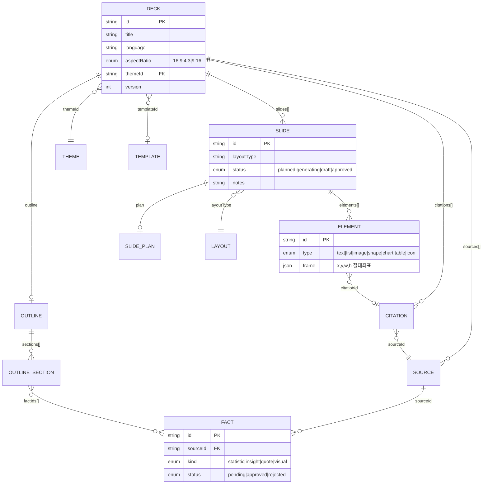

# DATA MODEL — 데이터 모델

> 코드 정본: `packages/schema/src/*` (zod). 이 문서는 관계와 저장 전략을 설명한다. DB DDL은 P2에서 이 모델을 기준으로 확정.

## 도메인 모델 관계

## 핵심 불변식 (Invariants)

1. **모든 요소 좌표는 가상 캔버스 기준** — 16:9=1280×720px. 렌더러는 px→CSS, 익스포터는 px→inch(÷96) 변환만 한다.
2. **색상은 hex 리터럴 또는 `token:colors.*` 참조** — 테마 교체가 슬라이드 데이터 수정 없이 전파되어야 한다.
3. **인용 역추적 체인**: element.citationId → citation.sourceId → source. 끊긴 참조는 검증 단계에서 거부.
4. **승인 게이트 통과 팩트만 생성에 투입** — `fact.status === 'approved'`가 아닌 팩트는 슬라이드 계획의 `factIds`에 들어갈 수 없다.
5. **슬라이드 상태 기계**: planned → generating → draft → approved (역방향은 재생성 시 draft로만).
6. **layoutType은 templates 패키지 레지스트리에 존재하는 키** — 미등록 레이아웃은 생성 단계에서 거부.

## 저장 전략 (P2에서 확정)

| 데이터 | 저장 방식 | 이유 |
|---|---|---|
| 덱 스냅샷 | `decks` 테이블 + JSONB(`deck` 컬럼) | 스키마 진화에 유연, 전체 로드가 기본 액세스 패턴 |
| 슬라이드 개별 수정 | JSONB 부분 업데이트 + `version` 증가 | 페이지 단위 수정이 핵심 UX |
| 버전 히스토리 | `deck_revisions` (deckId, version, snapshot, cause) | 롤백/비교 (P5) |
| 소스/팩트 | 정규 테이블 (`sources`, `facts`) | 게이트 UI가 행 단위 승인/거절 — 관계 질의 필요 |
| 생성 잡 | `jobs` (status, payload, 이벤트 로그 JSONB[]) | SSE 재접속 재생, `FOR UPDATE SKIP LOCKED` 큐 |
| 설정 | `system_settings` KV (타입드 카탈로그) | ai-news-hub 동적 설정 패턴 |
| 프롬프트 override | `prompt_overrides` | prompts-as-data |

## SSE 이벤트 계약

`packages/schema/src/events.ts`의 `generationEventSchema`가 정본. 이벤트 13종:
`job_started · research_started · source_found · facts_extracted · gate_waiting(facts|outline|slide_plan) · outline_ready · slide_plan_ready · slide_started · slide_delta · slide_done · deck_done · export_ready · job_error`
