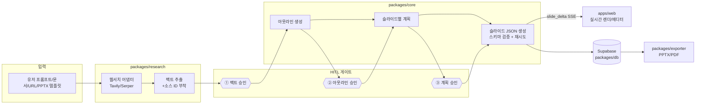

# Im PPT Generator 아키텍처 개요

## 시스템 구조

## 핵심 결정 (ADR 요약)

1. **JSON 스키마 → 듀얼 렌더러** (HTML 자유 렌더 → 사후 변환 방식 기각)
   - 근거: 수동 편집 + 페이지 단위 AI 수정 + 편집 가능한 PPTX export가 동시 성립하는 유일한 구조. Gamma(HTML 방식)의 PPTX export 깨짐이 반면교사.
2. **레이아웃은 코드, 콘텐츠는 AI** — Beautiful.ai/Presenton 방식. LLM 출력은 레이아웃 선택 + 스키마 준수 콘텐츠로 제한.
3. **가상 캔버스 절대좌표(16:9 = 1280×720px)** — 렌더러와 PptxGenJS 익스포터가 같은 좌표계 공유(px → inch 변환만).
4. **의미 단위 SSE 이벤트** (`packages/schema/src/events.ts`) — 토큰 스트림이 아닌 `slide_started/slide_delta/slide_done` 단위. 재접속 시 이벤트 재생 가능하도록 잡 테이블에 영속(P3).
5. **색상은 테마 토큰 참조(`token:colors.primary`) 허용** — 테마 교체 시 전 슬라이드 자동 반영, 하드코딩 방지.
