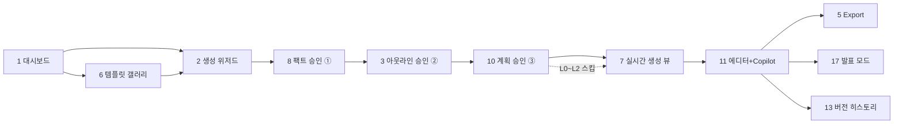

# UI/UX GUIDE — 화면 설계

> 비주얼 레퍼런스: Stitch export 4화면(대시보드/템플릿 갤러리/에디터+Copilot/딥서치·팩트 승인) — 코드는 재작성, 디자인 언어만 계승. 누락 화면은 동일 디자인 언어로 신규 설계.

## 화면 목록 (우선순위)

| # | 화면 | 설명 | 레퍼런스 | Phase |
|---|---|---|---|---|
| 1 | 대시보드 | Create New 3카드(AI Prompt / Transform File / Templates) + 최근 덱 그리드 | Stitch `_1` | P1 |
| 2 | 생성 위저드 | 프롬프트 + 옵션(장수/톤/청중/언어/비율) + 자율도 선택 + 참고 URL 입력 | 신규 | P1 |
| 3 | 아웃라인 승인 | 섹션 리스트 편집(드래그 재정렬/제목 수정/삭제/추가) → 승인 | 신규 ⭐게이트② | P1 |
| 4 | 덱 뷰어 | 슬라이드 렌더 + 썸네일 릴 + Export 버튼 | Stitch `ai_1` 축소판 | P1 |
| 5 | Export 다이얼로그 | PPTX/PDF 포맷 선택 → 진행 → 다운로드 | 신규 | P1 |
| 6 | 템플릿 갤러리 | 카테고리/비율/컬러 필터 + 카드 hover "Use this template" | Stitch `_2` | P1(기본)→P6 |
| 7 | **실시간 생성 뷰** | 활동 로그 타임라인 + 슬라이드가 그려지는 캔버스(slide_delta) + 진행바 + 조기 중단 | 신규 ⭐핵심 UX | P2 |
| 8 | 리서치/팩트 승인 | 소스 입력(URL/업로드) + 분석 큐 + 팩트 타임라인(승인/거절/Approve All) | Stitch `ai_2` ⭐게이트① | P3 |
| 9 | 소스 매니저 | 소스↔팩트↔슬라이드 매핑 뷰, 인용 역추적 | 신규 ⭐차별화 | P3 |
| 10 | 슬라이드 계획 승인 | 페이지별 계획 카드(레이아웃 미리보기+디자인 의도+내용 요약) → 승인/수정 요청 | 신규 ⭐게이트③ 시장공백 | P4 |
| 11 | 에디터 + AI Copilot | 3분할: 썸네일 릴 + 캔버스 + 우측 Copilot 챗(출처 칩, Regenerate/Add Page) | Stitch `ai_1` | P4 |
| 12 | 속성 패널 | 우측 패널 탭 전환(Copilot ↔ 속성): 요소별 편집 폼 | 신규 | P5 |
| 13 | 버전 히스토리 | 버전 타임라인 + 비교 + 롤백 | 신규 | P5 |
| 14 | 브랜드킷 | 로고/팔레트/폰트 관리 | 신규(사이드바 링크만 존재) | P6 |
| 15 | 템플릿 업로드 | PPTX 업로드 → 추출 결과 미리보기 → 저장 | 신규 | P6 |
| 16 | 설정 | 프롬프트 카탈로그/모델 라우팅/동적 설정 | ai-news-hub 설정 셸 패턴 | P2 |
| 17 | 발표 모드 + 발표자 뷰 | 풀스크린 + 노트/다음 슬라이드/타이머 | 신규 | P9 |

## 실제 구현 현황 (2026-07-04)

원래 17종 설계 위에 **콘텐츠 품질 트랙 UI**가 추가됨. 구현된 라우트: `대시보드(index)` · `생성 위저드(create)` · `에디터(editor.$id)` · `최근(recent)` · `템플릿 갤러리(templates)` · `브랜드킷(brand-kit)` · `AI 설정(settings)` · `공유 뷰어(share.$id)`.

품질/AI 기능 UI(에디터 내):
- **발표 유형 선택기**(생성 위저드) — 10종 아이콘 카드 + 서사·권장 슬라이드 수·테마 색 점(ADR-010)
- **제목 점검**(Ghost Deck 뷰) — 제목만 순서 + 논리 골격 배지(ADR-009)
- **품질 진단**(Deck Doctor 뷰) — 점수 원형 + 슬라이드별 개선점 + **AI 자동 수정** 버튼(ADR-012)
- **AI 도구 드롭다운** — 발표자 노트·예상 질문·접근성 점검·번역(언어 7종)·리라이트(톤 프리셋)
- **다른 디자인 보기**(Copilot 패널) — 레이아웃 변형 3종 실렌더 썸네일 → 클릭 교체
- **CSV→차트**(생성 위저드 접이식 카드) — 데이터 붙여넣기 → 즉시 차트 덱
- **AI 설정 화면** — 모델 연결 카드(읽기) + 프롬프트 에디터(편집·기본값 복원)

렌더 품질: **오버플로 자동수정**(넘칠 때 폰트 축소, 웹+PPTX), **워터폴 차트** 지원.

## 핵심 플로우

## 실시간 생성 뷰 상세 (화면 7 — 제품의 얼굴)

- 좌측: **활동 로그 타임라인**(Manus 스타일) — `research_started`("웹 검색 중: AI 시장 규모..."), `source_found`(파비콘+제목), `slide_started`("슬라이드 3/15 생성 중") 이벤트가 실시간 추가
- 중앙: **라이브 캔버스** — 현재 생성 중 슬라이드가 `slide_delta`마다 점진적으로 그려짐(요소가 하나씩 나타나는 애니메이션), 완료된 슬라이드는 하단 썸네일 릴에 쌓임
- 게이트 도달 시: 캔버스가 게이트 UI로 전환 + `gate_waiting` 배지, 사이드에 "대기 중" 펄스
- 상단: 전체 진행바(N/M 슬라이드) + 조기 중단 버튼
- 이탈 후 재접속: 이벤트 재생으로 동일 상태 복원

## UX 원칙

1. **AI 순간은 항상 시안 컬러 + 글래스** — 유저가 "지금 누가 조작 중인가"를 색으로 안다
2. **수동 편집은 항상 즉시/무료** — Gamma 원칙 차용, AI 액션만 잡으로
3. **모든 AI 산출물에 출처 칩** — 칩 클릭 → 소스 매니저
4. **게이트는 막지 않는다** — 게이트 대기 중에도 이미 생성된 슬라이드는 열람/편집 가능
5. **빈 상태·로딩·에러 3종 상태를 모든 화면이 소유** — EmptyState/Spinner/Alert 프리미티브
